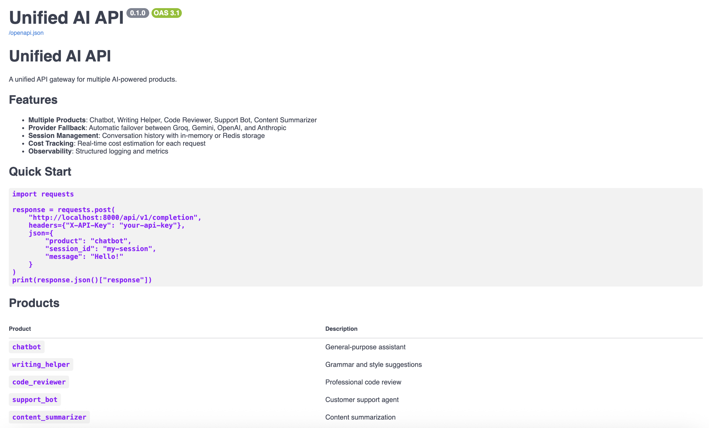
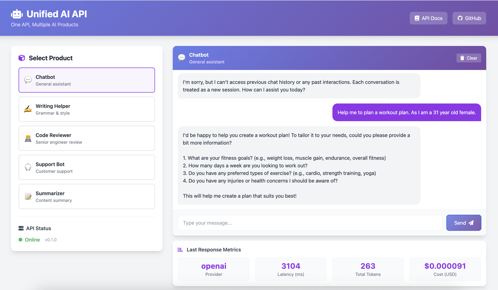
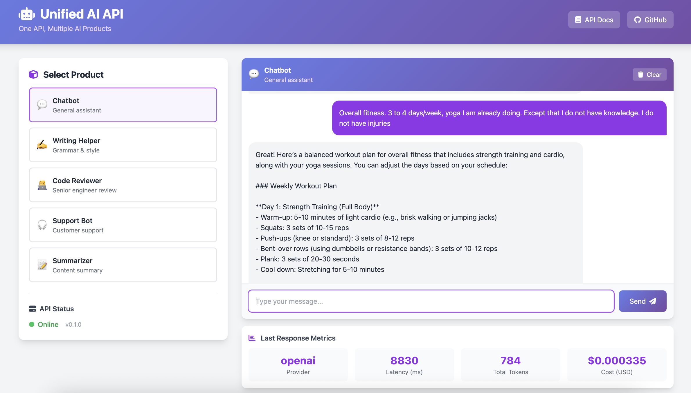

# Unified AI API

[](https://github.com/SAMithila/unified-ai-api/actions/workflows/ci.yml)
[](https://www.python.org/downloads/)
[](https://opensource.org/licenses/MIT)






> **One API, Multiple AI Products** — A unified gateway for LLM-powered applications with automatic failover, session management, and cost tracking.

## 🎯 Overview

Unified AI API is a production-ready FastAPI application that powers multiple AI products through a single, unified interface. It demonstrates:

- **Clean Architecture**: Modular design with clear separation of concerns
- **Provider Abstraction**: Support for Groq, Gemini, OpenAI, and Anthropic with automatic failover
- **Session Management**: Conversation history with in-memory and Redis backends
- **Cost Tracking**: Real-time cost estimation for each request
- **Production Patterns**: Structured logging, health checks, Docker deployment

## 🏗️ Architecture

```
┌─────────────────────────────────────────────────────────────────┐
│                         API Gateway                              │
│                     /api/v1/completion                           │
└─────────────────────────────────────────────────────────────────┘
                              │
        ┌─────────────────────┼─────────────────────┐
        ▼                     ▼                     ▼
┌───────────────┐   ┌───────────────┐   ┌───────────────┐
│   Chatbot     │   │ Code Reviewer │   │  Summarizer   │
│   Product     │   │    Product    │   │   Product     │
└───────────────┘   └───────────────┘   └───────────────┘
                              │
                    ┌─────────┴─────────┐
                    ▼                   ▼
            ┌─────────────┐     ┌─────────────┐
            │  Fallback   │     │   Session   │
            │   Chain     │     │   Storage   │
            └─────────────┘     └─────────────┘
                    │
    ┌───────────────┼───────────────┐
    ▼               ▼               ▼
┌───────┐     ┌───────┐       ┌───────┐
│ Groq  │────▶│Gemini │──────▶│OpenAI │
│(fast) │     │(cheap)│       │(smart)│
└───────┘     └───────┘       └───────┘
```

## 🚀 Quick Start

### Prerequisites

- Python 3.10+
- At least one LLM API key (Groq recommended for development)

### Installation

```bash
# Clone the repository
git clone https://github.com/SAMithila/unified-ai-api.git
cd unified-ai-api

# Create virtual environment
python -m venv venv
source venv/bin/activate  # On Windows: venv\Scripts\activate

# Install dependencies
pip install -e ".[dev]"

# Copy environment template
cp .env.example .env

# Edit .env and add your API keys
```

### Running the API

```bash
# Development mode with auto-reload
make run

# Or directly
uvicorn unified_ai.main:app --reload
```

Visit http://localhost:8000/docs for interactive API documentation.

### Example Usage

```python
import requests

# Simple chatbot request
response = requests.post(
    "http://localhost:8000/api/v1/completion",
    json={
        "product": "chatbot",
        "session_id": "my-session",
        "message": "Hello! What can you help me with?"
    }
)
print(response.json()["response"])

# Code review request
response = requests.post(
    "http://localhost:8000/api/v1/completion",
    json={
        "product": "code_reviewer",
        "session_id": "pr-123",
        "message": """
def calculate_average(numbers):
    total = 0
    for n in numbers:
        total = total + n
    return total / len(numbers)
        """
    }
)
print(response.json()["response"])
```

## 📦 Products

| Product | Description | Use Case |
|---------|-------------|----------|
| `chatbot` | General-purpose assistant | Customer Q&A, general help |
| `writing_helper` | Grammar and style assistant | Document editing, proofreading |
| `code_reviewer` | Senior engineer code review | PR reviews, code quality |
| `support_bot` | Customer support agent | Technical support, troubleshooting |
| `content_summarizer` | Content summarization | Article summaries, TL;DR |

## 🔧 Configuration

Configuration is managed via environment variables or `.env` file:

```bash
# LLM Providers (at least one required)
GROQ_API_KEY=your-groq-key      # Fastest, recommended for development
GOOGLE_API_KEY=your-gemini-key  # Good price/performance
OPENAI_API_KEY=your-openai-key  # Most capable

# Provider fallback order
LLM_PROVIDER_ORDER=groq,gemini,openai

# Optional: Redis for persistent sessions
REDIS_URL=redis://localhost:6379/0
```

## 🧪 Testing

```bash
# Run all tests with coverage
make test

# Run only unit tests
make test-unit

# Run only integration tests
make test-int

# Run linter
make lint
```

## 🐳 Docker Deployment

```bash
# Build and run with Docker Compose
make docker-up

# View logs
docker-compose -f docker/docker-compose.yml logs -f

# Stop services
make docker-down
```

## 📊 API Response

Every completion request returns comprehensive metrics:

```json
{
  "response": "Generated AI response...",
  "session_id": "user-123",
  "product": "chatbot",
  "provider": "groq",
  "model": "llama-3.3-70b-versatile",
  "input_tokens": 45,
  "output_tokens": 128,
  "latency_ms": 234.5,
  "cost_usd": 0.000089,
  "fallback_used": false
}
```

## 🛠️ Project Structure

```
unified-ai-api/
├── src/unified_ai/
│   ├── api/              # FastAPI routes and schemas
│   ├── core/             # LLM clients, products, fallback logic
│   ├── storage/          # Session storage (memory, Redis)
│   ├── config.py         # Configuration management
│   └── main.py           # Application entry point
├── tests/                # Unit and integration tests
├── docker/               # Docker configuration
└── docs/                 # Documentation
```

## 🎯 Key Features for Portfolio

This project demonstrates:

1. **Clean Code**: Modular architecture, type hints, comprehensive docstrings
2. **Design Patterns**: Abstract factory, strategy pattern (fallback), dependency injection
3. **Production Readiness**: Health checks, structured logging, error handling
4. **Testing**: Unit tests, integration tests, mocking
5. **DevOps**: CI/CD, Docker, environment configuration
6. **LLM Integration**: Multiple providers, cost tracking, session management

## 📈 Future Improvements

- [ ] Add streaming response support
- [ ] Implement rate limiting middleware
- [ ] Add API key authentication
- [ ] Create usage analytics dashboard
- [ ] Add prompt versioning for A/B testing
- [ ] Implement response caching

## 👤 Author

**Mithila** - AI/ML Engineer

- GitHub: [@SAMithila](https://github.com/SAMithila)

## 📄 License

This project is licensed under the MIT License - see the [LICENSE](LICENSE) file for details.
